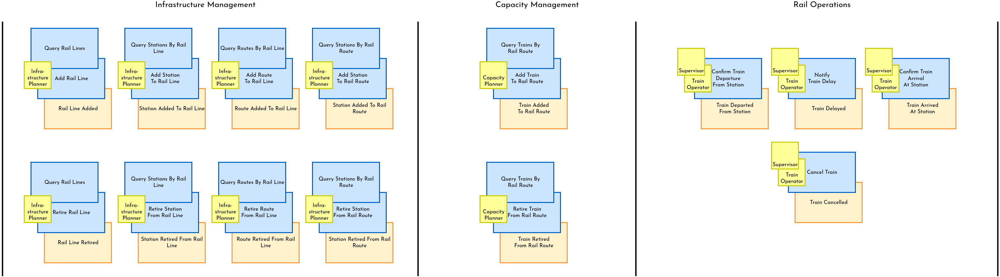
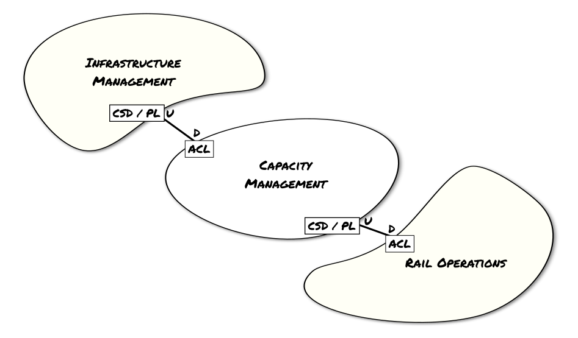

# demo-1 Foundations of Domain Driven Design and Clean Architecture
This demonstration project illustrates the principles and patterns of Domain Driven Design and Clean Architecture.

## Sprint 1 - Strategic Design Using Event Storming
Often the biggest hurdle in kicking off a demonstration project is deciding on a suitable domain example. I wanted something that is relatable, yet suitably complex to support the concepts I intend to explore. I've decided on the commuter train business domain, which is rich enough to offer opportunities in administrative, operational and ecommerce areas.

Full disclosure: While I am a frequent commuter of the GO Transit service in the Greater Toronto area, I am not a subject matter expert in this domain. Therefore, I will be simplifying and speculating on many of the details of what goes on behind the scenes while I play the part of the product SME in this project.

I have employed _Event Storming_ to explore this domain and identify a set of bounded contexts. Event Storming is typically a group collaboration including one or more domain subject matter experts. We'll dive into Domain Storming in more detail another time, but the premise is quite simple: a large wall space is covered with a paper roll representing a timeline. Group members then start adding sticky notes containing significant _Domain Events_ in order to model the business process of the domain. Once a timeline of events has been established, clusters of associated events will emerge. These clusters are indicative of independent bounded contexts. The group then works their way backwards, using different colour-coded sticky notes, to attach meaningful Commands to each event, representing the domain activity that triggers the resulting event. Stickies representing meaningful domain _Queries_ may also be attached to each Command, indicating domain data that may be required to facilitate the inputs to a Command. Finally, using yet another colour of sticky notes, _Users_ may be attached to each Command and Query that is triggered by a user activity, as opposed to an automated component of the system. This allows distinct user roles and their responsibilities and authorities to be captured.

As you can see, the results of this exercise reveal three distinct bounded contexts. I have intentionally stopped at this point, even though I can easily imagine additional events and contexts further down the timeline related to traffic management, ticket commerce, ticket activation and cancelation, ticket scanning (revenue protection), payment processing, etc. In fact, I may not yet have reached the bounded context that represents what I consider the _Core Domain_ of the system I am modelling. Ticket purchase and ecommerce are certainly viable candidates, but I'm leaning towards focusing on either the Rail Operations context or the real-time schedule displays that inform both operations as well as commuters as more managable for the purpose of this demonstration. This may span different contexts, but I've already recognized that much of the data I will need depends on the contexts I've already modelled. We can return to the Event Storming exercise to elaborate on these details, but we have more than enough to get underway with the next phase of this project.

## Sprint 2 - Bounded Contexts and Context Mapping
Now that we've identified some candidate bounded contexts, let's have a look at their relationships to one another. This is where a _Context Map_ is an essential tool.

A Context Map is an analysis of the relationship between two bounded contexts. From a strategic design perspective, organizational considerations are at least as significant as the technical considerations. It is critical to understand the dynamics between the teams responsible for each of the bounded contexts, as they will heavily influence whether a given mapping strategy will succeed or fail.

The first thing to consider is whether there exists an upstream and downstream relationship, in which the one bounded context depends on, or is impacted by, the other. This will help inform the choice of specific integration patterns to employ. In this case, there is clearly a sequence of dependencies on the creation of entities in the upstream contexts that play a role in the downstream contexts. For instance, the Rail Routes of the Infrastructure Management context are the prerequisites on which Trains are added or removed in Capacity Management. These trains and their schedules form the structural prerequisites of the Rail Operations context, which manages the status of each instance of a train as per its recurring daily or weekly schedule.

Given the nature of these dependencies, we will assume a Customer-Supplier Development (CSD) pattern applies to the upstream end-point of each of these mapping relationships. A CSD pattern indicates the upstream team may succeed interpendently of the downstream team, and the needs of the downstream team are factored into their planning. A Published Language (PL) pattern is also applicable, given there are specific elements of the upstream domain which will be leveraged by the downstream bounded contexts. A well-documented shared language will facilitate any necessary translation of this domain information between the two contexts. On the downstream end-point, an Anticorrupion Layer (ACL) will help bridge the communication between the two contexts. Given the assumption of CSD and PL on the upstream end, the ACL can be relatively simple rather than defensive in nature.